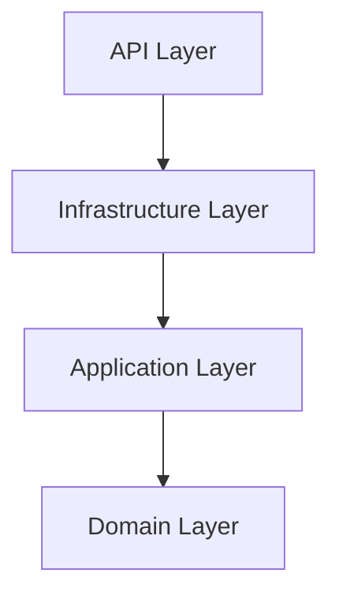

# Restaurant Reservation API 

This is a backend API for managing restaurant reservations following the Clean Architecture Principles. This is a learning project from the [C# Academy Website](https://thecsharpacademy.com/project/100008/system-design-clean-architecture-reservations). It handles real-world business concerns such as seating parties across multiple tables if their party size exceeds the size of a single table, as well as preventing race-condition double bookings at the database level.

## Technogies Used
- .NET10/ASP.NET Core 
- PostgreSQL 17 - database/persistence
- Entity Framework Core - ORM, Code-First migrations, Fluent API
- MediatR 12 - CQRS-style command/query (request response) pipeline
- FluentValidation - command validation
- ASP.NET Core Identity - authentication, JWT bearer tokens
- Redis/Hybrid Cache - caching to improve API response times
- Seq - structured logging (via Serilog)
- MailKit/Mailpit - for sending email notifications after reservation scheduling/rescheduling/cancellation/completion /local SMTP testing
- Docker & Docker Compose - containerization
- xUnit, FluentAssertions, TestContainers - for architecture/integration testing

**Getting Started**
You can run this project via Docker Compose, which spins up the API as well as PostgreSQL, Redis, Seq and Mailpit.
Clone the repo and navigate to the solution root directory and run the following command:

```bash
docker compose up -d --build
```

***Once everything is up and running:***

| Service                            | URL                             |
|------------------------------------|---------------------------------|
| API (Scalar for testing endpoints) | http://localhost:8080/scalar/v1 |
| Seq (logs)                         | http://localhost:8081           |
| Mailpit (email)                    | http://localhost:8025           |

***Architecture Overview***
This project follows Clean Architecture Principals (with some Domain-Driven-Design thrown in). This application is organized into four layers:
- ***Domain*** - Core business entiries and rules (Restaurant, Table, TableGroup, Reservation etc.). This layer has no dependencies on any other layers. Business invariants (e.g. A table can only be added to a table group if they belong to the same restaurant) are enforced on this layer.
- ***Application*** - Depends only on the Domain Layer. Use cases are implemented at this layer via MediatR commands and queries (CQRS).
- ***Infrastructure*** - Depends on the Application and Domain layers. This layer handles Database persistence via EF Core as well as Email, Identity/authentication. This layer implements interfaces defined at the Application layer.
- ***API*** - Depends on the Application and Infrastructure layers. This is the ASP.NET Core Web API layer. It is implemented using Minimal API endpoints, request/response mapping as well as mapping errors/failure responses to Problem Details. This layer also handles the main wiring of dependency injection.

Dependencies flow inward:

Dependencies are enforeced via a dedicated architecture test suite.

## Key Design Decisions
***Multi-Table Reservations***
The original design rejected any reservation if no single table could seat the full party — a party of 10 would be turned away even if two free 6-seat tables sat right next to each other. Real restaurants don't work this way: staff combine adjacent tables to seat larger parties. 
Rather than computing table combinations dynamically, this project models combinability as pre-approved, restaurant-configured TableGroups — a known, finite set of tables that are physically allowed to be pushed together. Availability search checks single tables first, and only falls back to checking TableGroups (requiring all member tables to be free) if no single table fits. This keeps the search cheap and predictable — a simple loop over a small list, while still matching how restaurants actually operate.

***Preventing Double-Bookings at the Database Level***
Checking table availability in application code before inserting a reservation leaves a race-condition window: two near-simultaneous requests can both see a table as free and both succeed, double-booking it. Rather than relying solely on optimistic concurrency (which protects against conflicting updates, not conflicting inserts), this project uses a PostgreSQL EXCLUDE constraint on the reservation_tables table, enforced via a GiST index, to reject any overlapping reservation for the same table at the database level. This was done by creating a new migration and editing the migration file with raw PostgreSQL: 
```postgresql
CREATE EXTENSION IF NOT EXISTS btree_gist;
ALTER TABLE reservation_tables
    ADD CONSTRAINT no_overlapping_table_reservations
        EXCLUDE USING gist (
        table_id WITH =,
        tsrange(
                scheduled_reservation_reservation_day + scheduled_reservation_reservation_start,
                scheduled_reservation_reservation_day + scheduled_reservation_reservation_end
        ) WITH &&);
```
After which the migration was applied.
This is verified by an integration test that fires two concurrent reservation attempts for the same table and confirms exactly one succeeds. 

***PostgreSQL over SQL Server***
Beyond PostgreSQL's technical merits, this choice was also deliberate for a couple of reasons First, gaining experience with more than one database provider is something that I feel is very important for a developer, even though EF Core abstracts much of the actual SQL, I still felt it was important to use a different database provider than previous projects. Second, C# and .NET still carry a lingering reputation as a "Windows-only" ecosystem, despite .NET Core being open-source and cross-platform. This entire project was built on a GNU/Linux distribution, using .NET Core/ASP.NET Core and an open-source database to demonstrate that modern .NET applications aren't tied to any single vendor or operating system.

***Mailpit over a Real Email Provider***
Since this is a learning project and not an actual restaurant reservation system, using a real email provider (e.g., Gmail via an app password) would add setup friction without adding real value — every reviewer would need to configure their own credentials just to see email notifications work. Using MailKit: reservation confirmations and updates are sent exactly as they would be in production, but anyone running the project can simply open Mailpit's web UI and see the emails arrive in real time, with zero configuration required.

## Testing
This project uses both Architecture tests to ensure/enfore dependencies and Integration tests to test the entire application stack. The decision to exclude Unit Tests was deliberate for the reason being as I was initially writing them. I realized I was testing much of the same logic that was better tested via integration tests. 

## Things I Learned 
- Clean Architecture - This was obviously the most important aspect of this project/application. I learned how dependencies should flow, and how separating different concerns (e.g. business logic, from database logic) makes for a much cleaner codebase.
- Docker - This was perhaps the second most important aspect of this project, or possibly it can be considered as tied for first with Clean Architecture. This is the first project from the C# Academy that I have personally done that required the use of docker. At first this was challenging because it was admittedly new to me, but once I got the hang of it and actually dockerized my own application and ran it entirely containerized I saw both the value and power of using Docker. It is also true as I read that Docker solved the age-old problem of "It works on my machine but not on others".
- Caching - Caching was not an explict require for this project but in my research I saw the value of caching and wanted to implement it in this project. I decided to use the Hybrid Cache approach available in .NET which allows you to combine local caching with an external caching service (Redis).
- Problem Details - Learning about problem details and structuring standardized, consistent and easily parseable error messages to inform the end user of any issues with the system.
- Domain Driven Design - In my study of Clean Architecture, I learned that it is at times combined with Domain Driven Design. I will not say that this project adhers strictly to DDD, but I tried to implement it as best as I could where I could.

## Areas To Improve Upon
There is always room from improvement especially in software development. While I have learned a tremendous amount and have made many improvements in my own skillset while implementing this project. There is always so much more to learn. I know there are areas of this project that may not be optimal or could have been implemented better. So as with each project I will take what I learned and apply it further and keep learning and improving.